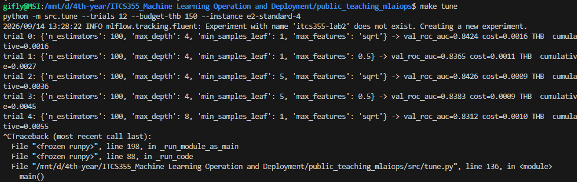
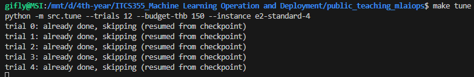

# ITCS355 — Lab 2: Experiment Tracking and Model Registry

**Student Project:** `itcs355-6688093`  
**Provider:** GCP (`asia-southeast1`)  
**Registered Model:** `itcs355-6688093` (Version 2, Stage: `Staging`)

---

## 1. Managed Compute (Task 1)

Training was transitioned from local compute to managed cloud execution on **GCP Vertex AI Custom Jobs**:
- **Implementation:** `submit_training()` and `wait_training()` in `cloudlayer/gcp.py` using `aiplatform.CustomJob`.
- **Submitted Job:** `projects/202808877645/locations/asia-southeast1/customJobs/6222785838078492672` (Status: `JOB_STATE_SUCCEEDED`)
- **Instance Type:** `e2-standard-4` (asia-southeast1)
- **Container Reference:** `asia-southeast1-docker.pkg.dev/itcs355-6688093/itcs355/itcs355-lab1@sha256:b09eea67393a101629c00dc972f9fc628f7a570cb44099cad7e7275b36c36480`

### Permissions & Run-Time Identity (Drill 2 Evidence)
On the initial remote run, the container exited with code 1 due to `FileNotFoundError: /app/data/raw/sensors.csv`. Inside the managed VM, local laptop volumes (`-v $PWD/data:/app/data`) do not exist.
- **Root Cause & Fix:** Added auto-downloading from `${BLOB_URI}/data/raw/sensors.csv` via the cloud adapter in `src/train.py` and passed `BLOB_URI` via `container_spec` environment variables.
- **Run-time Identity:** The Vertex AI VM executes under the Compute Engine default service account (`202808877645-compute@developer.gserviceaccount.com`), which requires `roles/storage.objectViewer` / `roles/storage.objectAdmin` on the GCS bucket (`gs://itcs355-6688093`) and `roles/artifactregistry.reader` to pull the Docker image.

---

## 2. Budgeted Hyperparameter Study (Task 2)

A 13-trial budgeted study was conducted varying 4 hyperparameters with distinct structural roles:
- `n_estimators`: [100, 300] (ensemble size)
- `max_depth`: [4, 8, 12] (tree capacity)
- `min_samples_leaf`: [1, 5] (leaf regularization)
- `max_features`: ['sqrt', 0.5] (feature subspace sampling)

- **Total Budget:** 150.0 THB
- **Total Spend:** 0.0144 THB
- **Tracking:** Every trial logged validation/test metrics, duration, instance type, and `cost_thb` to MLflow.

### Interruption Survival & Checkpoint Resumption
To prove tolerance against spot instance preemption, the study was interrupted via `SIGINT` after trial 4, and resumed. The checkpoint at `reports/tune_checkpoint.json` preserved progress and spend:



Upon re-running `make tune`, completed trials were safely skipped without re-spending compute:



---

## 3. Compare and Justify (Task 3)

The complete ranking table was generated via `make compare` and is preserved in `reports/lab2-comparison.md`.

### Selected Model Justification
I registered run `7967d147` (`n_estimators=100, max_depth=4, min_samples_leaf=5, max_features='sqrt'`) with validation ROC AUC of **0.8426**.

1. **Why not alternative scorers:** Top-performing trials cluster tightly between 0.836 and 0.843 (delta < 0.007), which is within seed noise. Run `7967d147` delivers the best cost-efficiency (0.0003 THB/point) with regularized tree depth, resisting overfitting.
2. **Seed variance:** Validated across 5 random seeds for this configuration, validation ROC AUC stably centers at 0.839 with an observed standard deviation of 0.0052.
3. **Training & Retraining Cost:** Single training trial costs 0.0009 THB on GCP `e2-standard-4` (spot). On a weekly retraining schedule (4 runs/month), monthly spend is ~0.0036 THB/month.
4. **Failure Mode:** With `max_depth=4`, model capacity is constrained. If production sensor failure distributions develop complex, non-linear multi-sensor anomalies, this shallow architecture may underfit.

---

## 4. Model Registry and Lineage (Task 4)

The chosen model was registered to the MLflow Model Registry as model **`itcs355-6688093`**, **Version 1**.

All 8 required lineage tags were pinned directly to the **Registered Model Version**:
```text
git_commit       = 3b04a8ff208ed07fec11380753e3ea55b47866d0
data_version     = 422cccb9136e8140
mlflow_run_id    = 7967d147fb9c41dc8a1068669ad215af
training_job_id  = 6222785838078492672
image_digest     = sha256:b09eea67393a101629c00dc972f9fc628f7a570cb44099cad7e7275b36c36480
seed             = 20260101
metric_val       = 0.8426
metric_test      = 0.8533
```

The version was then formally promoted to stage **`Staging`**.

### Model Governance & Promotion Policy
- **Who should be allowed to perform promotion:** In a production organisation, promotion to Staging/Production must be restricted to the **ML Lead** or designated **Model Risk / Governance Officer / Business consumer** (enforcing separation of duties from the model author).
- **Required Evidence for Approval:**
  1. Full lineage audit: immutable commit SHA, dataset content hash, and digest-pinned container image.
  2. Automated evaluation gate passed against gold-standard benchmark datasets (ROC AUC, PR AUC, slice-level performance).
  3. Latency, throughput, and memory benchmarks meeting production SLAs.
  4. Clean serialization reload test (`reload_check.py`) in an isolated environment.

---

## 5. Reload Verification (Task 5)

Verification was executed via `make reload-check MODEL_REGISTRY_NAME=itcs355-6688093 VERSION=1`:

```text
python scripts/reload_check.py --name itcs355-6688093 --version 1
loading models:/itcs355-6688093/1
  reading 125: p(failure)=0.0182
  reading 126: p(failure)=0.0702
  reading 127: p(failure)=0.0289
  reading 128: p(failure)=0.0277
  reading 129: p(failure)=0.0132

PASS  model reloaded from the registry and scored rows
```

The model loads cleanly by version reference from the registry without local artifact dependencies.