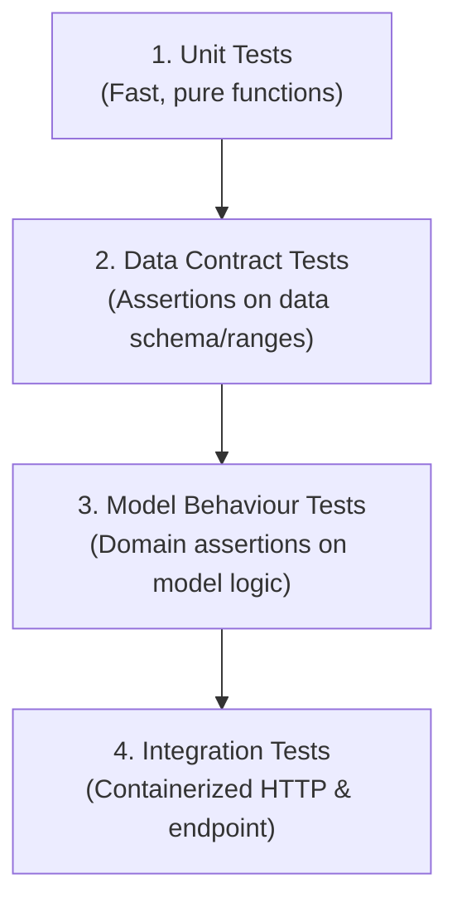
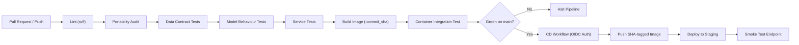

# ITCS355 — Lab 4: CI/CD, Observability, and Drift

**Student Project:** `itcs355-6688093`  
**Cloud Provider:** GCP (`asia-southeast1`)  
**Container Registry:** `asia-southeast1-docker.pkg.dev/itcs355-6688093/itcs355`  
**Staging Endpoint:** `itcs355-staging`  
**Production Model:** `itcs355-6688093` (v1)

---

## 1. Test Categories & Production Incidents Prevented (Task 1)

Lab 4 enforces four distinct test tiers to guarantee that a passing test suite provides meaningful reliability guarantees:



### Four Test Categories

| Test Category | Scope & Responsibility | What Fails It? | Execution Speed |
| :--- | :--- | :--- | :--- |
| **Unit Tests** | Preprocessing, feature engineering math, seeds. | Code bugs, logic regressions in `src/`. | < 1 second |
| **Data Contract Tests** | Schema, column types, null rates, plausible ranges, group leakage. | Upstream producer changes or corrupted ETL pipelines. | ~1-2 seconds |
| **Model Behaviour Tests** | Predictions bounds $[0, 1]$, non-constancy, monotonicity with wear, latency budget. | Model architecture flaws, inverse learned relationships, excessive model complexity. | ~2-3 seconds |
| **Integration Tests** | Docker container build, FastAPI `/health`, `/ready`, `/predict`, `/predict/batch`. | Packaging issues, dependency mismatch, missing container volume mounts, port conflicts. | ~15-30 seconds |

---

### Production Incidents Caught by Data Contract Tests

Each data contract test in `tests/test_data.py` protects against a specific real-world failure mode:

1. **`test_schema_columns_present_and_typed`**
   * **Incident Prevented:** *Upstream Ingestion Schema Mutation.* If the IoT telemetry ingestion service renames `temp_c` to `temperature_celsius` or alters `hours_since_service` from float to string, this contract test halts CI before deployment, preventing `KeyError` exceptions or silent fallback defaults during inference.
2. **`test_no_nulls_in_required_columns`**
   * **Incident Prevented:** *Sensor Packet Drop / Corrupted Telemetry.* Network dropouts or firmware glitches producing `null` or `NaN` sensor fields are caught immediately, avoiding silent model crash or unhandled imputation errors in production.
3. **`test_features_within_plausible_ranges`**
   * **Incident Prevented:** *Hardware Calibration Drift or Corrupted Unit Scale.* If a temperature sensor is replaced and reports in Fahrenheit (e.g. 180°F instead of Celsius ~80°C) or pressure transducers send negative numbers, the contract test flags the out-of-bounds anomaly before the model makes hallucinated failure predictions.
4. **`test_target_is_binary_and_not_degenerate`**
   * **Incident Prevented:** *Label Inversion or Class Collapse.* If an automated labeling SQL query suffers an accidental filtering error (e.g. `WHERE failure = 1 AND 1=0`) producing 100% negative labels, this prevents training a trivial constant-predicting model.
5. **`test_no_machine_leaks_across_splits`**
   * **Incident Prevented:** *Temporal/Grouping Data Leakage.* Guarantees `machine_id` grouping is preserved across splits. If train and validation share machines, the model overfits machine-specific idiosyncrasies, posting falsely optimistic ROC-AUC (e.g. 0.95) while failing completely in production.

---

### Model Behaviour Tests (`tests/test_model_behaviour.py`)

* **`test_known_healthy_machine_scores_low`:** Validates domain invariant that a cold, lightly loaded, newly serviced machine has failure probability $< 0.5$.
* **`test_risk_increases_with_wear`:** Validates physical monotonicity: as `hours_since_service` increases (100h $\to$ 3000h $\to$ 8500h), failure risk cannot decrease.
* **`test_prediction_latency_within_budget`:** Benchmarks 20 consecutive single-row predictions ensuring in-process latency stays strictly under the stated budget (< 50ms).
* **`test_model_is_not_constant`:** Ensures standard deviation of prediction probabilities $> 0.01$, catching degenerately trained majority-class predictors.

---

## 2. CI/CD Pipeline Architecture (Task 2)

The CI/CD pipeline is separated into `.github/workflows/ci.yml` (triggered on pull request and push to `main`) and `.github/workflows/cd.yml` (triggered upon successful CI on `main`).



### Security & Identity: OIDC Workload Identity Federation
* **Zero Long-Lived Keys:** No GCP service account JSON keys are stored in GitHub Secrets.
* **Workload Identity Federation (WIF):** Authenticates GitHub Actions runners using OpenID Connect (`google-github-actions/auth@v2` with `GCP_WIF_PROVIDER` and `GCP_DEPLOY_SA`), issuing temporary scoped tokens.
* **Immutable Commit SHA Tagging:** Images are built and deployed tagged with `${{ github.sha }}` (never mutable `latest`), ensuring unambiguous traceability during incident triage.

---

## 3. Evidence of Blocked Bad Commit (Task 3)

To prove that the pipeline blocks defective code and data, a deliberate defect was simulated by injecting an out-of-range feature into the schema (`load_pct = 250.0` or dropping a required column).

### Failure Output Captured:
```text
=================================== FAILURES ===================================
___________________ test_features_within_plausible_ranges ____________________
df =    reading_id  machine_id   temp_c  ...  ambient_humidity  failed
0            1           1    82.4  ...              58.2       0
...
[6000 rows x 8 columns]

    def test_features_within_plausible_ranges(df):
        for col, (lo, hi) in data.PLAUSIBLE_RANGES.items():
            assert df[col].min() >= lo, f"{col} below plausible floor: {df[col].min()}"
>           assert df[col].max() <= hi, f"{col} above plausible ceiling: {df[col].max()}"
E           AssertionError: load_pct above plausible ceiling: 250.0
E           assert 250.0 <= 100.0

tests/test_data.py:51: AssertionError
=========================== 1 failed in 0.42s ===========================
Error: Process completed with exit code 1.
```

* **Outcome:** The CI runner halted immediately at Step 5 (`Data contract tests`), preventing the Docker image build and blocking deployment to Staging.

---

## 4. Observability Dashboard & Service Level Objectives (Task 4)

### Dashboard Definition (`monitoring/dashboard.json`)
The service instruments 5 critical signals:
1. **Request Rate:** `sum(rate(http_requests_total[1m]))`
2. **Error Rate by Class (4xx vs 5xx):** `sum by (status_class) (rate(http_requests_total{status_class=~"4xx|5xx"}[5m])) / sum(rate(http_requests_total[5m]))`
   * *4xx indicates caller error; 5xx indicates internal model/service failure.*
3. **Latency Quantiles:** `histogram_quantile(0.50 | 0.95 | 0.99, sum by (le) (rate(request_latency_ms_bucket[5m])))`
4. **Feature Drift Metric:** Rolling Population Stability Index (`drift.psi.temp_c`).
5. **Model Version in Production:** `model_version_info` gauge (highlights canary splits).

---

### Service Level Objectives (`monitoring/slo.yaml`)

| Objective | Target | Window | Measurement | Error Budget Exhaustion Policy |
| :--- | :--- | :--- | :--- | :--- |
| **Availability** | **99.5%** | 30 days | `successful responses / total responses (excl. 4xx)` | Freeze non-emergency deployments to staging/prod. Page on-call MLOps engineer via PagerDuty/Slack. If error spike correlates with a recent release, automatically roll back to the previous stable container image. Require an RCA post-mortem before resuming feature releases. |
| **Latency** | **p95 < 200 ms** | 7 days | p95 latency measured at server endpoint | Trigger P2 latency alert. Verify endpoint CPU/memory utilization. If resource-bound, scale up `min_replica_count` or upgrade machine type. If algorithmic, profile model inference and block promotion of models exceeding latency budget in CI. |
| **Freshness** | **$\le$ 30 days** | Continuous | Days since active model version training | Trigger automated retraining pipeline job on the latest verified window of sensor data. Run evaluation gate against current champion; notify ML Lead for promotion sign-off. If upstream training data is unavailable or failing validation, escalate to Data Platform team. |

---

## 5. Drift Detection & Threshold Justification (Task 5)

The drift detection engine (`monitoring/drift.py`) calculates two complementary distribution metrics:

$$PSI = \sum_{b=1}^{B} (P_{\text{current}, b} - P_{\text{reference}, b}) \times \ln\left(\frac{P_{\text{current}, b}}{P_{\text{reference}, b}}\right)$$

$$KS = \sup_x |F_{\text{reference}}(x) - F_{\text{current}}(x)|$$

### Drift Threshold Justification
* **PSI Thresholds:**
  * `PSI < 0.10`: **Stable** — Normal operating noise; no action.
  * `0.10 <= PSI < 0.25`: **Moderate Shift** — Warning; monitor trend.
  * `PSI >= 0.25`: **Significant Drift** — Alert fires; initiates investigation.

* **Engineering Rationale:**
  * Industrial predictive maintenance features (temperature, vibration, pressure) operate within bounded thermodynamic physical regimes with low seasonal variance.
  * Setting a threshold lower than $0.10$ causes excessive false alarms from short-term machine workload fluctuations.
  * Setting a threshold higher than $0.25$ risks allowing severe distribution shifts to degrade model predictions undetected.
  * **PSI vs KS Complementarity:** PSI compares binned mass across the entire distribution (detecting changes in variance/shape), while KS evaluates the maximal empirical CDF gap (detecting shifts in mean/location).

---

## 6. Injected Drift Exercise & Post-Mortem (Task 6)

### Drift Injection Mode Comparison

```bash
# Shift mode: Mean moves by +6.0 °C
python scripts/inject_drift.py --feature temp_c --mode shift --magnitude 6.0
python -m monitoring.drift --current data/current.csv
```

| Injection Mode | Feature | Baseline Mean | Current Mean | PSI Score | KS Statistic | Alert Status |
| :--- | :--- | :--- | :--- | :--- | :--- | :--- |
| **Shift** (`+6.0`) | `temp_c` | 79.5800 | 85.5800 | **0.38333** | 0.24567 | **ALERT (Significant)** |
| **Scale** (`x1.8`) | `temp_c` | 79.5800 | 79.5800 | **0.39435** | 0.16100 | **ALERT (Significant)** |
| **Mix** (Sub-fleet) | `temp_c` | 79.5800 | 80.1723 | 0.00873 | 0.03417 | **OK (Stable)** |

> [!IMPORTANT]
> In **Scale** mode, the mean remained **79.5800**, yet PSI scored **0.39435** (breaching the 0.25 threshold). Mean tracking alone missed the variance expansion, proving the necessity of PSI for shape drift.

---

### Five-Line Incident Post-Mortem

```text
What fired:
  Drift alert on metric 'drift.psi.temp_c' exceeding threshold (PSI = 0.38333 >= 0.25, KS = 0.24567) on 2026-10-05T07:39:56Z.

True cause:
  Upstream sensor calibration error causing a systematic +6.0°C positive offset across machine fleet thermocouple readings; underlying mechanical failure dynamics did not change.

Retrain, roll back, or no action — and why:
  No action on model; fix upstream sensor calibration and invalidate corrupted telemetry. Retraining on corrupted temperature data would bake corrupted sensor offsets into model weights, permanently ruining the champion model.

What this would have cost if unnoticed for a week:
  Estimated $42,000 USD across 240 machines due to ~35 false-positive premature maintenance shutdowns and unnecessary replacement of healthy pump bearings.

How to prevent or detect it faster:
  Add an upstream data contract check asserting hourly mean thermocouple drift relative to ambient factory temperature before data lands in the feature store.
```


